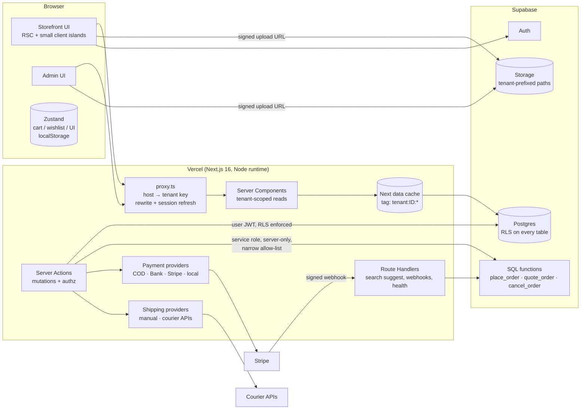

# Phase 0 — Architecture Overview

White-label, multi-tenant e-commerce platform. One Next.js deployment and one Supabase
project serve any number of stores. A store (tenant) is data, never code.

Priority order used for every trade-off in this document:
**security → tenant isolation → data integrity → maintainability → scalability → performance → DX → UI polish.**

---

## 1. Overall system architecture



- **One codebase, one database, shared schema, `tenant_id` on every business row.**
  This is the pooled model. A silo per tenant (one database per store) isolates more strongly, but it costs far more to run and migrate. For a
  catalogue/order workload with thousands of small stores, pooled + RLS is the industry default
  (Shopify-style), and a large tenant can be moved to its own project later without code changes.

## 2. Frontend architecture

- **Next.js 16 App Router, Server Components by default.** Every catalogue page renders on the
  server from cached, tenant-scoped queries. Client Components are limited to islands that need
  the browser: cart drawer, add-to-cart, wishlist toggle, carousels, filter sheet, forms, uploads.
- **Routing:** everything tenant-facing lives under `src/app/[domain]/…`. The proxy rewrites
  `store-a.example.com/products` → `/store-a/products` internally, so the visitor never sees the
  segment and **there is no URL that can address another tenant**. Any path is prefixed with the
  current host's tenant key, so `/store-b/...` typed on store A's host becomes
  `/store-a/store-b/...`, which is a 404.
- `[domain]/layout.tsx` is a **root layout** (it renders `<html>`). The tenant's theme CSS
  variables therefore sit on `<body>` and also reach portals (dialogs, sheets, toasts).
- **Feature modules** (`src/features/*`) hold business logic (queries, actions, schemas, services).
  `src/components/*` is presentation only. UI never talks to Supabase directly.
- **State:** URL = source of truth for filters, sort and pagination (shareable). Zustand only for truly
  client-side state (cart, wishlist, drawers). The server is the source of truth for prices and stock.

## 3. Backend architecture

| Concern | Mechanism | Why |
|---|---|---|
| Public catalogue reads | Server Components → `unstable_cache` → anon Supabase client (no cookies) | Cacheable per tenant, RLS still applies as `anon`. |
| Authenticated reads (admin, account) | Server Components → cookie-bound Supabase client | Runs as the user; RLS enforces membership. |
| Mutations | Server Actions | Built-in CSRF protection (Origin check), typed, colocated with forms. |
| Money / stock | Postgres functions (`place_order`, `cancel_order`) | One transaction, row locks, no client-trusted values. |
| Third-party callbacks | Route Handlers (`/api/webhooks/*`) | Need raw body + signature verification. |
| Search suggestions | Route Handler (GET) | Cacheable at the CDN, debounced client fetch. |
| Async/background (emails, courier sync) | Supabase Edge Functions / cron (future) | Out of the request path. |

## 4. Database architecture

Postgres (Supabase). Key rules:

- `tenant_id uuid not null` on every tenant-owned table, including child tables such as
  `product_images` and `order_items`. It is denormalised on purpose: RLS policies stay single-table (fast, simple), and
  composite foreign keys `(tenant_id, parent_id)` **make cross-tenant references impossible at the
  constraint level** (a product in store A cannot point at a brand in store B).
- Money is `numeric(12,2)`, never float. `total_amount` is enforced by a CHECK constraint.
- Orders store **snapshots** (name, SKU, image, unit price) so history never changes.
- `products.price` and `products.is_on_sale` are **generated columns**, so sorting and filtering by effective
  price is indexable and can never disagree with `sale_price`/`original_price`.
- Full-text search via a maintained `tsvector` (`simple` config: language-agnostic) + `pg_trgm`.
- Audit trails: `order_status_history`, `inventory_movements` (written by triggers, so they cannot be skipped).

Full schema and every additional table explained: [`docs/02-database.md`](02-database.md).

## 5. Multi-tenancy architecture

```
hostname ──► tenant key ──► tenant row (cached) ──► tenant.id used by every query
```

- **Tenant key** = subdomain label (`store-a`) *or* full custom domain (`shop-a.com`). A key
  containing a dot is a custom domain; subdomain labels cannot contain dots, so there is no ambiguity.
- The tenant ID is **never accepted from the client**. Server Actions re-derive the tenant from
  the `Host` header with the same pure function the proxy uses.
- Repository functions take `tenantId` as a required first argument. There is no
  "query without tenant" API in the codebase.

## 6. Authentication architecture

- Supabase Auth (email + password now; OAuth providers enabled by config only; the callback route
  already handles the PKCE code exchange).
- `@supabase/ssr` stores the session in **httpOnly-capable cookies per host**. The proxy
  refreshes the session only on `/admin`, `/account`, `/checkout` and `/auth` paths (keeps catalogue
  requests cookie-free and cacheable).
- Server code always calls `supabase.auth.getUser()` (verifies the JWT with Supabase), never
  trusts `getSession()` alone.
- Identities are platform-wide (one `auth.users`), membership is per tenant (`tenant_members`).

## 7. Authorization architecture

Three layers. Layers 2 and 3 each block cross-tenant access on their own; layer 1 is only a UX shortcut.

1. **Proxy** — early redirect to `/login` for `/admin/*` without a session (UX only).
2. **Server** — `requireAdminPage(tenant, role)` in every admin layout/page and `authorize(tenant, capability)`
   in every admin Server Action (via `adminAction()`), with the tenant re-derived from the Host header.
3. **Database** — RLS policies based on `tenant_members` (`owner > admin > manager > staff`).

Customers are any authenticated user. They are not tenant members and can only see their own orders
and wishlist. Role matrix: [`docs/04-auth.md`](04-auth.md).

## 8. Storage architecture

Four buckets (`tenant-assets`, `product-images`, `category-images`, `brand-images`), all
**public-read** (catalogue images must be CDN-served, and no secrets live in them), with
**tenant-prefixed object paths** `{tenant_id}/{uuid}.{ext}`. Write policies check membership against
the first path segment. The bucket config enforces MIME allow-lists (no SVG) and size limits server-side.
Uploads use short-lived **signed upload URLs** created by a Server Action after an authz check.

## 9. Payment architecture

`PaymentProvider` interface (`createPayment / verifyPayment / refundPayment`) with a registry
keyed by payment method. Checkout calls `registry.get(method).createPayment(order)` and receives either
`{ status: 'pending', instructions }` (COD, bank transfer) or `{ redirectUrl }` (Stripe / hosted
local gateways). Card data never touches our servers (PCI SAQ-A). Payment state changes only through
verified webhooks → `payment_transactions` (idempotent on `provider + provider_reference`).

## 10. Order architecture

1. The client sends only `{ productId, quantity }[]`, customer details, payment method, coupon code and an idempotency key.
2. Server Action: validate (Zod) → rate-limit → resolve tenant from host → `quote_order` (DB
   prices) → shipping provider computes the fee → `place_order` (single transaction):
   lock product rows `FOR UPDATE` in id order (deadlock-free) → check stock → recompute totals →
   abort with `PRICE_CHANGED` if the quote drifted → insert the order and items → decrement stock (trigger logs
   the movement) → redeem the coupon → create a pending payment transaction.
3. Payment provider `createPayment` → redirect or confirmation page.
4. The confirmation URL carries a random `public_token`, because guest orders contain PII and an ID
   alone must not reveal them.

## 11. Deployment architecture

GitHub → Actions (typecheck, lint, unit tests, DB tests against a disposable Supabase stack, build)
→ Vercel (preview per PR, production on `main`). Supabase migrations are applied by CI with
`supabase db push` on `main` before the Vercel production deploy. Details: [`docs/08-deployment.md`](08-deployment.md).

## 12. Domain routing architecture

| Host | Classification | Tenant key |
|---|---|---|
| `store-a.example.com` | subdomain of `NEXT_PUBLIC_ROOT_DOMAIN` | `store-a` |
| `example.com`, `www.example.com` | platform root | none (platform page) |
| `shop-a.com`, `www.shop-a.com` | custom domain | `shop-a.com` |
| `store-a.localhost:3000` | dev subdomain | `store-a` |
| `localhost:3000` / `*.vercel.app` | dev / preview | `DEV_TENANT` env |

Vercel wildcard domain `*.example.com` gives every subdomain automatic SSL. A custom domain is added to
the Vercel project (API or dashboard) and stored as `tenants.custom_domain`. It becomes live once DNS
points at Vercel **and** `custom_domain_verified_at` is set, so a domain cannot be claimed before it is verified.

## 13. Security architecture

Defence in depth: RLS on every table (deny-by-default), composite tenant FKs, security-definer
functions with `search_path = ''`, `service_role` usage confined to one server-only module and
a small allow-list of operations, Zod on every input, rate limiting in Postgres, signed webhooks,
CSP and security headers, no SVG uploads, no raw HTML rendering of tenant content.
Full review: [`docs/07-security.md`](07-security.md).

## 14. Caching strategy

| Data | Strategy |
|---|---|
| JS/CSS/fonts, `public/` | Static, immutable, CDN |
| Tenant config, theme, categories, brands, nav, banners | `unstable_cache`, tag `tenant:{id}`, revalidate 1 h, **invalidated on admin save** |
| Product lists and detail | `unstable_cache`, tag `tenant:{id}:products`, revalidate 5 min + on save |
| Search suggestions | Route Handler, `s-maxage=60, stale-while-revalidate` |
| Stock shown on product detail page | Cached (display only). Authoritative check at checkout |
| Cart refresh, checkout quote, orders, admin, account | Dynamic, never cached |

Why not `cacheComponents` / `'use cache'`: its default handler is in-memory, so on
serverless each instance starts cold. The tagged data cache persists across instances and deploys on Vercel,
which suits an unbounded number of tenants where build-time prerendering has little value.

## 15. SEO strategy

Tenant-aware `generateMetadata` (title template `%s | {store}`, canonical from the tenant's
primary host, Open Graph and Twitter cards), per-tenant `sitemap.xml` and `robots.txt` (served through
the same rewrite), JSON-LD (`Organization`/`Store`, `Product` + `Offer` + `AggregateRating`,
`BreadcrumbList`). Preview and dev hosts are `noindex`. When a tenant has a verified custom domain, canonical
URLs, the sitemap and JSON-LD all point to it, and its subdomain is added in Vercel as a domain that
308-redirects to the custom domain (see `docs/08-deployment.md`), so there is never duplicate content across hosts.
