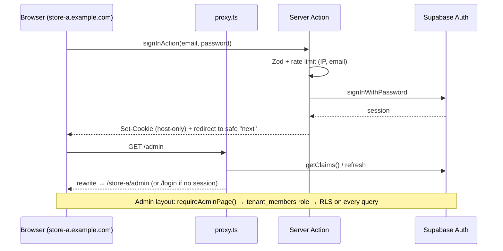

# Phase 4 — Authentication & authorization

## Authentication

- **Supabase Auth**, email + password (min 8 chars, letters + digits; enforced by Zod and by Auth config).
- Sessions live in cookies **per host**, set by `@supabase/ssr`. A customer signs in separately on each
  store domain; the account (identity) is shared platform-wide.
- `proxy.ts` refreshes the session only on `/admin`, `/account`, `/checkout`, `/login`, `/register`,
  `/auth`, and the password pages. Catalogue requests stay cookie-free and cacheable.
- Server code uses `supabase.auth.getUser()` (validated with Supabase), never `getSession()`.
- **OAuth (optional):** enable a provider in Supabase → Auth → Providers and call
  `supabase.auth.signInWithOAuth({ provider, options: { redirectTo: <host>/auth/callback } })`.
  `/auth/callback` already performs the PKCE code exchange and only redirects to same-origin paths.
- Abuse controls: sign-in is rate limited per IP and per email; the same error is returned for unknown
  email and wrong password (no account enumeration); password reset always reports success.

## Roles

`owner > admin > manager > staff` are **tenant members**. A **customer** is any signed-in user;
customers are not members.

| Capability | owner | admin | manager | staff | customer |
|---|:-:|:-:|:-:|:-:|:-:|
| Dashboard (revenue) | ✓ | ✓ | ✓ | | |
| View orders, update fulfilment & tracking, internal notes | ✓ | ✓ | ✓ | ✓ | |
| Change payment status, cancel/return orders | ✓ | ✓ | ✓ | | |
| Products, categories, brands (CRUD, bulk), view costs | ✓ | ✓ | ✓ | | |
| Reviews moderation, banners, coupons | ✓ | ✓ | ✓ | | |
| Store settings, branding, pages, navigation | ✓ | ✓ | | | |
| Add/remove members (non-owner) | ✓ | ✓ | | | |
| Manage owners | ✓ | | | | |
| Own orders, wishlist, reviews | ✓ | ✓ | ✓ | ✓ | ✓ |
| Change subdomain / custom domain / store status | platform operator (service role) only |||||

Sources of truth: `src/features/auth/roles.ts` (UI + actions) and `app_private.role_rank()` +
policies (database). They are kept in sync deliberately; the database is authoritative.

## Enforcement layers

1. `proxy.ts`: redirects anonymous `/admin` visits to `/login` (UX).
2. `src/app/[domain]/admin/layout.tsx` → `requireAdminPage(tenant, "staff")`. Pages raise the minimum
   (for example `manager` for products). Non-members go to `/forbidden`; members lacking the role go to Orders.
3. Every admin Server Action uses `adminAction(name, capability, fn)`: the tenant comes from the Host
   header, `authorize()` verifies the user and capability, and errors are sanitised.
4. RLS + guard triggers in Postgres.

Next.js docs are explicit that Server Actions are reachable by direct POST, so the
check lives inside each action, not only in the layout.

## Platform operations

- **Create a store:** `npm run tenant:provision -- --name "Acme" --subdomain acme --owner a@acme.com`
  (service role; invites the owner by email).
- **Demo stores:** sign up, then `select public.seed_grant_demo_owner('you@example.com');` (dev only).
