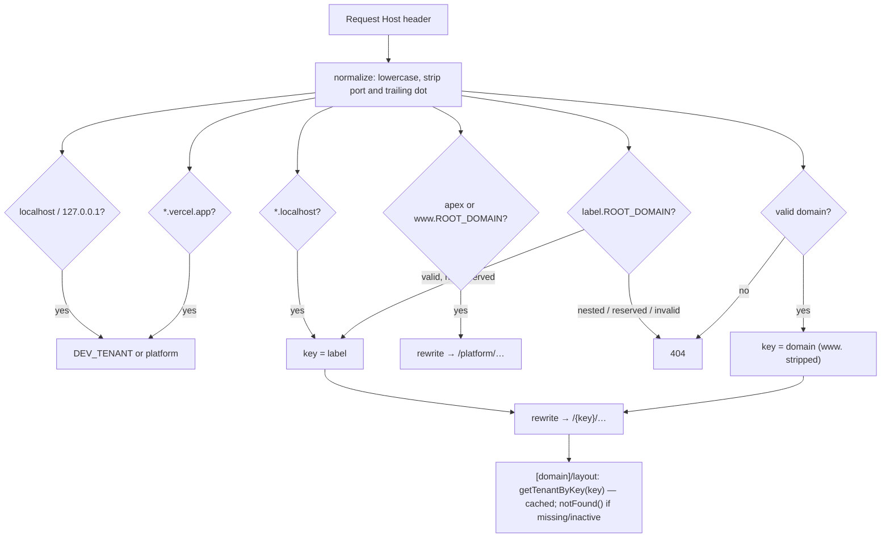

# Phases 5–6 — Tenant resolution & dynamic branding

## Resolution flow

Implementation: `src/lib/tenant/hostname.ts` (pure, unit-tested) + `src/proxy.ts` + `src/features/tenants/`.

### `tenant.example.com` vs `customstore.com`

| | Subdomain | Custom domain |
|---|---|---|
| DNS | One wildcard `*.example.com` record for all tenants | The tenant's own record (A/CNAME) pointing at Vercel |
| TLS | Vercel wildcard certificate (automatic) | Per-domain certificate issued by Vercel after DNS verification |
| Tenant key | `tenant` (the label) | `customstore.com` (full domain; `www.` stripped) |
| DB lookup | `tenants.subdomain = key` | `tenants.custom_domain = key AND custom_domain_verified_at IS NOT NULL` |
| Provisioning | Instant (row insert) | Add the domain to the Vercel project (dashboard/API), verify DNS, then the operator sets `custom_domain_verified_at` |

The "verified" flag keeps someone from claiming a domain in the DB before they control its DNS.

### Why the tenant isn't loaded in the proxy

A DB lookup in the proxy would run on every request (including prefetches and route handlers) and
can't use the Next data cache. The proxy only classifies the host (pure string work); the
tenant row is loaded once per request by the root layout from a cached function, and suspended or
unknown tenants 404 there.

### Why rewrites make cross-tenant URLs impossible

The proxy always *prepends* the key derived from the Host header. `/store-b/products` on store A's
host becomes `/store-a/store-b/products`, which matches no route. Server Actions do not trust the
URL at all; they re-resolve the tenant from the Host header.

## Branding

- Stored in `tenants.brand_config` (validated by `brandConfigSchema`): `primary_color`,
  `secondary_color`, `accent_color`, `logo_url`, `favicon_url`, `font_family`, `radius`.
- `buildThemeStyle()` converts the brand into CSS variables on `<body>`:
  `--primary`, `--primary-foreground` (auto-contrast), `--secondary`, `--highlight`
  (tenant accent: badges), `--accent` (tint of primary: hover surfaces), `--ring`, `--radius`, `--font-sans`.
  shadcn/ui and Tailwind classes read only these variables.
- Fonts are an allow-list (`src/config/fonts.ts`, loaded with `next/font`, `preload: false`), because
  `next/font` must be static and arbitrary font URLs would be a privacy and performance risk.
- `TenantProvider` gives Client Components the public tenant config (currency, locale, contact,
  shipping rules). Colours are server-rendered CSS, so there is no flash of unbranded content.
- Store name, logo, favicon, contact info, social links, footer columns, trust badges, homepage
  sections, price ranges, policies and location are all data. No component contains tenant content.
