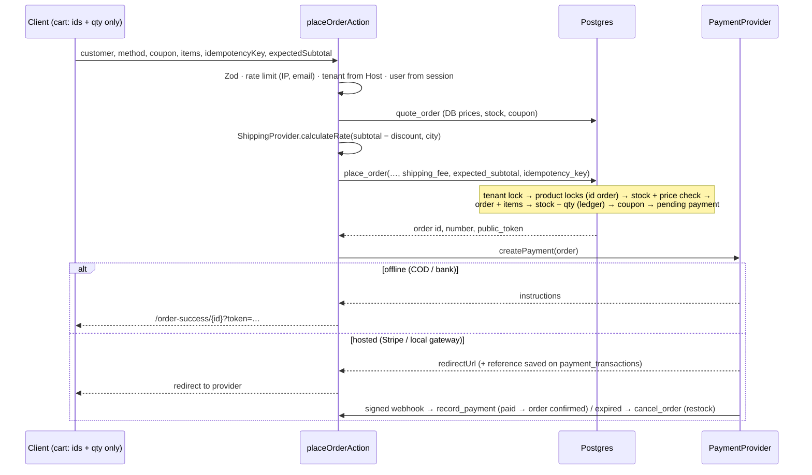
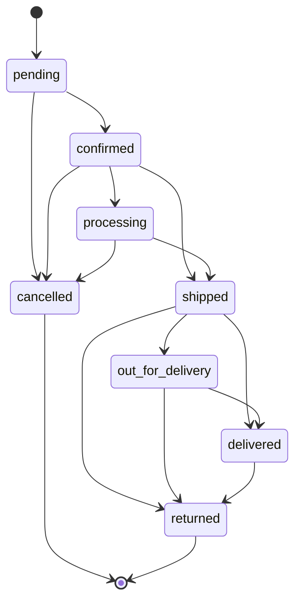
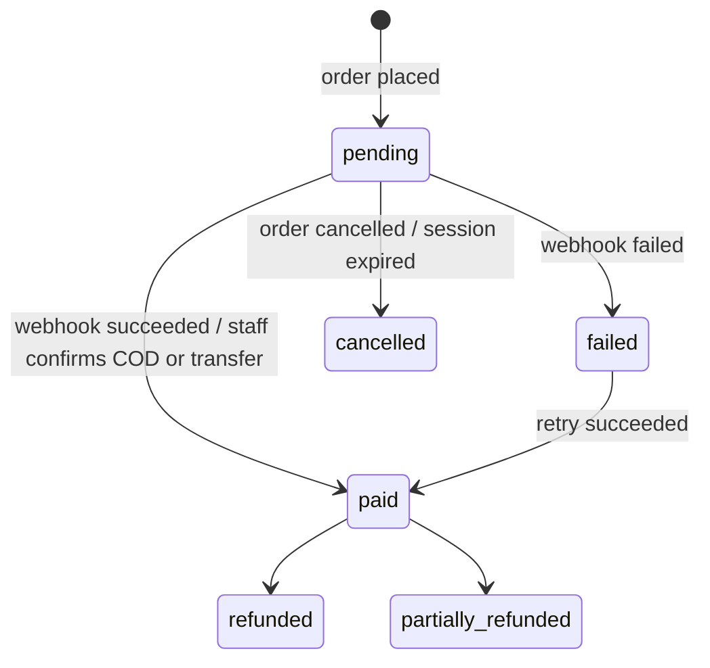

# Phases 16–18 — API architecture, payments, shipping

## When to use what

| Mechanism | Use for | Examples in this codebase |
|---|---|---|
| **Server Components + cached queries** | Reads rendered into HTML | `features/*/queries.ts` |
| **Server Actions** | Mutations from our own UI (CSRF-protected by Next's Origin check, typed, progressive) | checkout, auth, admin CRUD, uploads (signing), wishlist, reviews |
| **Route Handlers** | Public GET endpoints needing HTTP caching; third-party callbacks that need the raw body | `/api/search/suggest`, `/sitemap.xml`, `/robots.txt`, `/api/webhooks/stripe`, `/api/health`, `/auth/callback` |
| **Postgres functions** | Anything that must be atomic or row-locked | `place_order`, `cancel_order`, `record_payment`, `admin_save_product` |
| **Supabase Edge Functions** (future) | Async work outside the request: transactional email, courier status polling, search-index sync, abandoned-cart jobs | triggered by DB webhooks / `pg_cron` |

## Endpoint map

| Domain | Read | Write |
|---|---|---|
| products | `listProducts`, `getProductBySlug`, `getSectionProducts`, `/api/search/suggest` | `saveProductAction`, `bulkProductAction` |
| categories / brands | `getCategoryTree`, `getBrands` | `save/deleteCategoryAction`, `save/deleteBrandAction` |
| cart | client store | `refreshCartAction` (server re-pricing) |
| checkout | `getCheckoutQuoteAction` | `placeOrderAction` |
| orders | `getOrderByPublicToken`, `listMyOrders`, `listAdminOrders` | `updateOrderStatusAction`, `updatePaymentStatusAction`, `updateTrackingAction` |
| reviews | `getProductReviews`, `getLatestReviews` | `submitReviewAction`, `moderateReviewsAction` |
| tenants | `getTenantByKey`, `getStoreSettings` | `save*SettingsAction`, `saveStorePageAction` |
| uploads | — | `createSignedUploadAction`, `deleteUploadAction` |
| payments | — | `/api/webhooks/stripe` → `record_payment` |
| shipping | `ShippingProvider.calculateRate` (inside quote) | `ShippingProvider.createShipment` (tracking) |

All actions return `ActionResult<T>` = `{ ok: true, data } | { ok: false, error: { code, message, fieldErrors? } }`.
Route handlers return `{ error: { code, message } }` with a matching HTTP status. Internal errors are
logged with a reference id and never returned verbatim.

## Checkout flow



Failure handling: `INSUFFICIENT_STOCK` / `PRICE_CHANGED` → client re-quotes and shows what changed;
a payment that fails to start cancels the order (stock restored); double-submits return the same
order (idempotency).

## Order lifecycle



`cancelled` and `returned` restore stock (via `cancel_order` / `return_order` only).

## Payment lifecycle



## PaymentProvider

```ts
interface PaymentProvider {
  id; method; label
  isAvailable({ settings }): boolean        // tenant enabled AND platform configured
  createPayment(order, ctx): Promise<PaymentResult>          // offline instructions | redirect
  verifyPayment(reference, ctx): Promise<PaymentVerification>
  refundPayment({ reference, amount, currency }, ctx): Promise<RefundResult>
}
```

| Provider | Status |
|---|---|
| Cash on Delivery | Implemented |
| Bank transfer | Implemented (tenant bank accounts, manual confirmation) |
| Stripe Checkout | Implemented with REST + HMAC webhook verification. **Configure:** `STRIPE_SECRET_KEY`, `STRIPE_WEBHOOK_SECRET`, webhook endpoint `https://<platform-domain>/api/webhooks/stripe` for `checkout.session.completed`, `…async_payment_succeeded`, `…async_payment_failed`, `…expired`. Optional Stripe Connect per tenant via `stripe_account_id`. |
| Local gateway (JazzCash / Easypaisa / PayFast / bank IPG) | **Template only** (`local-gateway.ts`, `isAvailable() = false`) with step-by-step integration notes. Needs merchant credentials. |

Adding a provider never touches the checkout UI or `placeOrder`: implement the interface, register
it in `lib/payments/registry.ts`, and add a webhook route that calls `record_payment`.

## ShippingProvider

```ts
interface ShippingProvider {
  calculateRate({ orderValue, city, currency, config }): Promise<ShippingRate>
  createShipment(input): Promise<ShipmentResult>
  trackShipment(input): Promise<TrackingResult>
}
```

`manual` is implemented: free above a threshold, then a per-city rate, then a flat rate; staff enter the
courier and tracking number (the order moves to `shipped`). A courier API provider (TCS, Leopards, Trax,
PostEx…) implements the same interface, is registered in `lib/shipping/registry.ts`, and is selected per
order via `orders.shipping_provider`.
